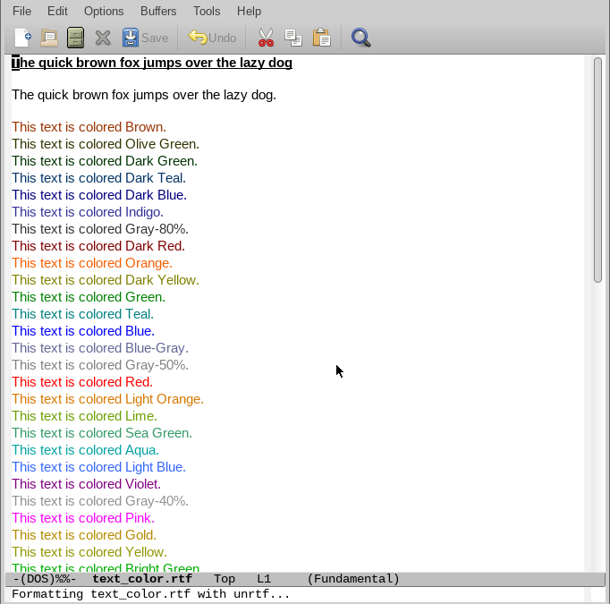

# rtf-view.el

A wrapper around [GNU unrtf](https://www.gnu.org/software/unrtf/) to view RTF files in Emacs:

No editing yet.

## Installation

Available from [MELPA](https://github.com/milkypostman/melpa).
